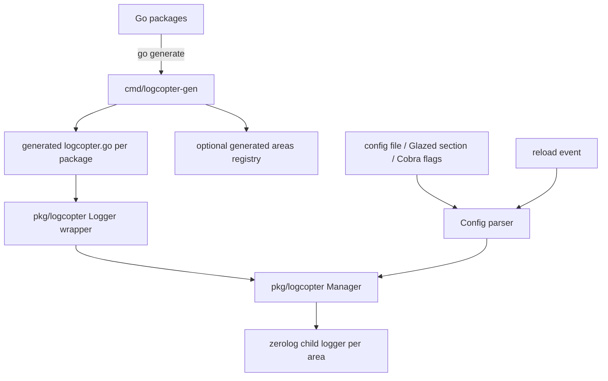
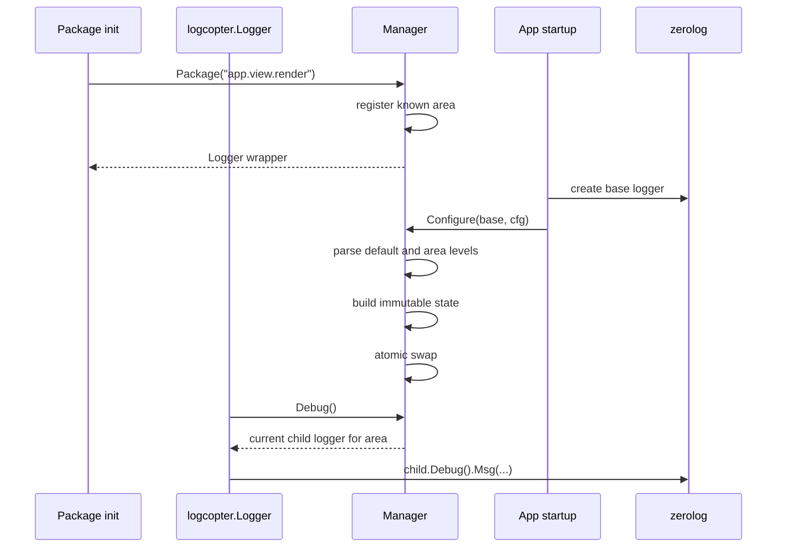
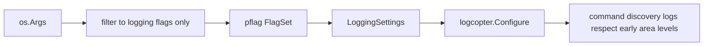

# Initial logcopter implementation guide

## Executive summary

Logcopter should be a small Go logging library and generator that keeps `zerolog` as the backend while adding one missing feature: package-boundary scoped log levels that can be configured by stable names such as `app.view.render`, `app.db`, or `lib.ble.rx`.

The target developer experience is:

```go
// Code generated by logcopter-gen; DO NOT EDIT.
package render

import "github.com/go-go-golems/logcopter/pkg/logcopter"

var log = logcopter.Package("app.view.render")
```

Then package code can write normal zerolog-style event chains:

```go
func Render(name string) {
    log.Trace().Str("template", name).Msg("render start")
    log.Debug().Msg("cache lookup")
}
```

At startup, the application configures one process-wide logcopter manager from a base `zerolog.Logger` and a config object:

```go
err := logcopter.Configure(baseLogger, logcopter.Config{
    Level:  "info",
    Format: "json",
    Areas: map[string]string{
        "app.view":        "debug",
        "app.view.render": "trace",
        "app.db":          "warn",
        "lib.ble":         "error",
    },
})
```

The important implementation constraint is that normal filtering must use per-area child logger levels, not `zerolog.SetGlobalLevel`. Glazed currently uses `SetGlobalLevel` for one global CLI level; that works for today's single-level CLI behavior, but it cannot support `trace` in one package while keeping another package at `warn`. Logcopter should use the global level only as an optional emergency clamp and leave it permissive by default.

This guide is written for a new intern. It explains the existing repository state, how Glazed logging works today, the proposed logcopter architecture, the public APIs, the generator, the required changes to Glazed's existing logging package, test strategy, and a phased implementation plan.

## Problem statement and scope

### The problem

Plain `zerolog` gives us fast structured logging, child loggers, and per-logger levels, but application packages still need a convention for creating the right child logger. Without a convention, teams either:

- use `github.com/rs/zerolog/log` everywhere, which only supports a global level;
- manually create child loggers in each package, which creates repetitive boilerplate and inconsistent area names;
- pass loggers down through every call path, which is correct for request-scoped context but annoying for package-scope diagnostics;
- filter by parsing emitted logs, which is expensive and late.

Logcopter should solve the package-scope diagnostics problem by generating a package-local logger variable with a stable area string. The area string becomes the config key for level lookup.

### Scope for the initial version

The initial version should include:

1. A `pkg/logcopter` runtime package.
2. A `cmd/logcopter-gen` generator that writes generated logger files.
3. Updates to Glazed's existing `pkg/cmds/logging` section and initialization code so Glazed can configure logcopter area levels directly.
4. Unit tests for level parsing, inheritance, reload, known areas, and invalid reload behavior.
5. Generator tests for package path to area conversion and generated source validity.
6. Basic CLI smoke tests for the generator.
7. Documentation examples in the repository README.

### Explicit non-goals for the initial version

The source proposal is clear that logcopter should not replace `zerolog`, should not parse emitted JSON to filter logs, should not use hooks as the primary filtering mechanism, and should not require `go generate` as part of `go build`. Keep those constraints intact.

For the first implementation, do not build:

- a long-running file watcher for reload;
- an admin UI;
- dynamic config persistence;
- support for non-zerolog backends;
- automatic rewriting of user config files;
- backwards-compatibility shims for deprecated APIs unless explicitly requested.

## Current repository and workspace state

### Logcopter repository state

The `logcopter` repository is currently still a template skeleton:

- `logcopter/go.mod:1` still says `module github.com/go-go-golems/XXX`, so the first implementation phase must rename it to `github.com/go-go-golems/logcopter`.
- `logcopter/go.mod:3` declares Go `1.25`.
- `logcopter/cmd/XXX/main.go:1-5` contains an empty `main` package.
- `logcopter/pkg/doc.go:1-5` contains an empty `pkg` package.
- `logcopter/README.md:1` still identifies the repository as `GO GO TEMPLATE`.

The workspace includes `logcopter`, `glazed`, `geppetto`, and `pinocchio` in one `go.work` file, so local development can test logcopter against nearby Glazed and Pinocchio checkouts (`go.work:3-7`).

### Relevant dependency facts

Glazed already depends on `zerolog` (`glazed/go.mod:29`) and Cobra (`glazed/go.mod:30`). Pinocchio also depends on `zerolog`, Cobra, Glazed, Geppetto, and Clay (`pinocchio/go.mod:15-28`). This means logcopter can design around the exact logging stack already used by the surrounding projects.

## Source proposal summary

The imported source proposal is stored at:

```text
logcopter/ttmp/2026/05/25/LOGCOPTER-001--initial-logcopter-implementation-design/sources/01-log-chatgpt-proposal.md
```

The proposal defines the central concepts:

- **Area**: a stable logging namespace such as `app.view.render` or `lib.ble.rx`.
- **Package prefix**: a generator-provided namespace prefix such as `app` or `lib.ble`.
- **Effective level**: the level selected by longest-prefix lookup.
- **Generated package logger**: `var log = logx.Package("app.view.render")`.
- **Runtime manager**: a reloadable manager that owns base logger, configured area levels, known areas, and derived child loggers.
- **Generator**: a command that converts Go package import paths into area names and writes `logx.go` files.

The proposal also highlights the crucial runtime design: the generated variable should be a wrapper, not a raw `zerolog.Logger`, because a raw logger freezes its level when it is created. The wrapper must resolve the current underlying logger at call time so config reload can affect already-created package loggers.

## How Glazed logging works today

Understanding Glazed matters because logcopter should remain mostly a utility package while Glazed remains the CLI and configuration integration layer used by the surrounding applications.

### Glazed's logging section

Glazed defines logging settings in `glazed/pkg/cmds/logging/section.go`:

```go
type LoggingSettings struct {
    WithCaller  bool   `glazed:"with-caller"`
    LogLevel    string `glazed:"log-level"`
    LogFormat   string `glazed:"log-format"`
    LogFile     string `glazed:"log-file"`
    LogToStdout bool   `glazed:"log-to-stdout"`
}
```

This is in `glazed/pkg/cmds/logging/section.go:13-20`. The section slug is `logging` (`section.go:22`). `NewLoggingSection` creates a Glazed schema section with five fields: `with-caller`, `log-level`, `log-format`, `log-file`, and `log-to-stdout` (`section.go:24-64`).

The root-command helper `AddLoggingSectionToRootCommand` manually registers those fields as persistent Cobra flags (`section.go:78-99`). The comment at `section.go:85-91` says this is a manual workaround for root persistent flags; ordinary Glazed command sections can use the generic `AddSectionToCobraCommand` mechanism.

Glazed also supports per-command section parsing. `SetupLoggingFromValues` extracts the `logging` section from parsed values and calls `InitLoggerFromSettings` (`section.go:102-108`). `GetLoggingSettings` uses `parsedValues.DecodeSectionInto(logging.LoggingSectionSlug, &settings)` (`section.go:111-119`).

### Glazed's logger initialization

`glazed/pkg/cmds/logging/init.go` initializes the actual zerolog logger:

- if `WithCaller` is true, it adds caller information (`init.go:17-21`);
- it sets `zerolog.TimeFieldFormat` to `time.RFC3339Nano` (`init.go:23-24`);
- it chooses `zerolog.ConsoleWriter` for text or `os.Stderr` for JSON (`init.go:26-36`);
- it can route to a rotating `lumberjack.Logger` when `LogFile` is set (`init.go:38-63`);
- it replaces `log.Logger` output and sets `zerolog.DefaultContextLogger` (`init.go:65-68`);
- it maps the configured level to `zerolog.SetGlobalLevel` (`init.go:70-83`).

The last point is the key limitation for logcopter. Global level is correct for a traditional `--log-level debug` CLI, but it is not sufficient for package-scoped levels. If global level is set to `info`, no child logger can emit `debug` or `trace` events. Therefore, logcopter should preserve the output/caller/file ideas from Glazed but not use `SetGlobalLevel` for normal area filtering.

### Cobra-based initialization pattern

Glazed's modern pattern is to read logging flags directly from Cobra after parsing. `InitLoggerFromCobra` reads `--log-level`, `--log-file`, `--log-format`, `--with-caller`, and `--log-to-stdout` from the current command and then calls `InitLoggerFromSettings` (`glazed/pkg/cmds/logging/init.go:94-135`).

The `glaze` binary uses this pattern directly:

```go
var rootCmd = &cobra.Command{
    Use: "glaze",
    PersistentPreRunE: func(cmd *cobra.Command, args []string) error {
        return logging.InitLoggerFromCobra(cmd)
    },
}

func main() {
    err := logging.AddLoggingSectionToRootCommand(rootCmd, "glaze")
    cobra.CheckErr(err)
    // register commands
    _ = rootCmd.Execute()
}
```

This is visible in `glazed/cmd/glaze/main.go:19-30` and command registration continues through `main.go:32-97`.

### Early logging in complex applications

Pinocchio has a more complex bootstrap because it loads commands and repositories before Cobra executes the final command. Its root command still initializes logging in `PersistentPreRunE` (`pinocchio/cmd/pinocchio/main.go:44-50`), but `main()` also calls `logging.InitEarlyLoggingFromArgs(os.Args[1:], "pinocchio")` before command discovery (`pinocchio/cmd/pinocchio/main.go:53-63`).

The early initializer intentionally filters the raw args down to only known logging flags before parsing, so it does not fail on subcommand-specific flags that have not been registered yet (`glazed/pkg/cmds/logging/init-early.go:10-60`). It then constructs a standalone pflag set with defaults that match the root logging flags (`init-early.go:62-107`).

Pinocchio then initializes help, calls `clay.InitGlazed("pinocchio", rootCmd)`, adds profile settings, adds special commands, loads repositories, and registers generated commands (`pinocchio/cmd/pinocchio/main.go:142-172` and `main.go:202-286`). This is a useful model for logcopter: complex apps may need an early logger before all generated package loggers and command definitions are available.

### How Glazed sections attach to Cobra

The generic section implementation is useful background for updating Glazed's existing logging section. `schema.SectionImpl` implements `schema.CobraSection` (`glazed/pkg/cmds/schema/section-impl.go:21-22`). `AddSectionToCobraCommand` delegates to `Definitions.AddFieldsToCobraCommand` and then registers a flag group (`section-impl.go:216-227`). The Cobra parser iterates all sections and calls `AddSectionToCobraCommand` for every `CobraSection` (`glazed/pkg/cli/cobra-parser.go:221-240`).

Logcopter should not ship its own Glazed section package. Instead, Glazed's existing `pkg/cmds/logging` package should grow the logcopter-aware fields and initialization behavior in-place, preserving the current imports used by applications.

## Proposed architecture

### High-level diagram



### Runtime package layout

Use a small number of focused files:

```text
logcopter/
  pkg/logcopter/
    config.go          # Config, AreaWarning, parsing helpers
    level.go           # ParseLevel, aliases, validation
    manager.go         # Manager, immutable state, Configure
    logger.go          # Logger wrapper, event methods
    output.go          # output writer construction: stderr/stdout/file/text/json
    areas.go           # area validation, normalization, longest-prefix lookup
    global.go          # default manager package-level helpers
  cmd/logcopter-gen/
    main.go            # generator CLI
    packages.go        # go/packages discovery and area derivation
    render.go          # generated file rendering
```

Keep the logcopter runtime package independent from Glazed. Glazed may import `pkg/logcopter` from its existing `pkg/cmds/logging` package, but `pkg/logcopter` must not import Glazed.

### Runtime manager model

The manager owns all mutable logging state, but callers should see a value-style wrapper that is safe to store in package-level variables.

```go
type Manager struct {
    mu    sync.Mutex        // protects known areas while building snapshots
    state atomic.Value      // stores *state
}

type state struct {
    base          zerolog.Logger
    configured    map[string]zerolog.Level
    defaultLevel  zerolog.Level
    known         map[string]struct{}
    strictAreas   bool
    areaField     string
    cache         map[string]zerolog.Logger
}

type Logger struct {
    manager *Manager
    area    string
}
```

The `state` should be treated as immutable after publication. `Configure` builds a new state from the previous known-area set, validates all levels first, builds derived loggers lazily or eagerly, and swaps the state atomically only after every parse step succeeds.

### Public runtime API

Initial public API:

```go
package logcopter

import "github.com/rs/zerolog"

type Config struct {
    Output      string            `yaml:"output" json:"output"`
    Format      string            `yaml:"format" json:"format"`
    Level       string            `yaml:"level" json:"level"`
    Caller      bool              `yaml:"caller" json:"caller"`
    Timestamp   bool              `yaml:"timestamp" json:"timestamp"`
    Areas       map[string]string `yaml:"areas" json:"areas"`
    StrictAreas bool              `yaml:"strict_areas" json:"strict_areas"`
}

type AreaWarning struct {
    Area    string
    Message string
}

func DefaultManager() *Manager
func Configure(base zerolog.Logger, cfg Config) error
func ConfigureDefault(cfg Config) error
func Package(area string) Logger
func For(area string) Logger
func Areas() []string
func EffectiveLevel(area string) zerolog.Level
func ValidateAreas(strict bool) []AreaWarning
```

Manager methods should mirror package-level helpers:

```go
func NewManager() *Manager
func (m *Manager) Configure(base zerolog.Logger, cfg Config) error
func (m *Manager) Package(area string) Logger
func (m *Manager) For(area string) Logger
func (m *Manager) Areas() []string
func (m *Manager) EffectiveLevel(area string) zerolog.Level
func (m *Manager) ValidateAreas(strict bool) []AreaWarning
```

Logger wrapper methods should preserve zerolog's event-style API:

```go
func (l Logger) Trace() *zerolog.Event
func (l Logger) Debug() *zerolog.Event
func (l Logger) Info() *zerolog.Event
func (l Logger) Warn() *zerolog.Event
func (l Logger) Error() *zerolog.Event
func (l Logger) Fatal() *zerolog.Event
func (l Logger) Panic() *zerolog.Event
func (l Logger) WithLevel(level zerolog.Level) *zerolog.Event
func (l Logger) Raw() zerolog.Logger
func (l Logger) Area() string
func (l Logger) IsZero() bool
```

`Raw()` should be documented as not reload-aware after capture.

### Manager lifecycle



### Default behavior before configuration

Generated package variables may be initialized before `main()` configures logging. That must be safe.

Initial default manager state should use `zerolog.Nop()` or a disabled logger and default level `disabled`. This means package imports cannot accidentally emit logs before the app chooses an output and level. Applications that need bootstrap logs can call an early configure function, as Pinocchio does today with Glazed early logging.

### Level parsing

Support these names:

```text
trace, debug, info, warn, warning, error, fatal, panic, off, none, disabled
```

Rules:

- trim whitespace;
- lowercase before parsing;
- map `warning` to `zerolog.WarnLevel`;
- map `off`, `none`, and `disabled` to `zerolog.Disabled`;
- otherwise delegate to `zerolog.ParseLevel`;
- return errors that include the area key when parsing area-specific levels.

Pseudocode:

```go
func ParseLevel(s string) (zerolog.Level, error) {
    normalized := strings.ToLower(strings.TrimSpace(s))
    switch normalized {
    case "off", "none", "disabled":
        return zerolog.Disabled, nil
    case "warning":
        return zerolog.WarnLevel, nil
    default:
        return zerolog.ParseLevel(normalized)
    }
}
```

### Hierarchical level lookup

Use longest-prefix matching on dot-separated area names.

Example config:

```yaml
logging:
  level: info
  areas:
    app.view: debug
    app.view.render: trace
    app.db: warn
```

Resolution:

```text
app.view.render.partial -> trace
app.view.assets         -> debug
app.db.sql              -> warn
app.http.server         -> info
```

Pseudocode:

```go
func resolveLevel(area string, configured map[string]zerolog.Level, fallback zerolog.Level) zerolog.Level {
    for current := area; current != ""; {
        if level, ok := configured[current]; ok {
            return level
        }
        i := strings.LastIndex(current, ".")
        if i < 0 {
            break
        }
        current = current[:i]
    }
    return fallback
}
```

### Area child logger construction

Filtering should be done by per-area child loggers:

```go
func (m *Manager) resolve(area string) zerolog.Logger {
    st := m.currentState()
    level := resolveLevel(area, st.configured, st.defaultLevel)
    return st.base.With().Str(st.areaField, area).Logger().Level(level)
}
```

Use a cache keyed by area inside the immutable state if profiling shows repeated construction matters. If the cache is immutable, build it during configure for every known area. If it is lazy, protect it with a manager mutex or use `sync.Map`; do not mutate a map stored inside an immutable state without synchronization.

Recommended initial implementation: no cache first. A child logger construction is simple and correctness matters more. Add caching only after benchmarks.

### Invalid reload behavior

`Configure` can be called multiple times. If the new config is invalid, do not modify the existing state.

Pseudocode:

```go
func (m *Manager) Configure(base zerolog.Logger, cfg Config) error {
    parsed, err := parseConfig(cfg)
    if err != nil {
        return err
    }

    old := m.currentState()
    next := &state{
        base:         decorateBase(base, cfg),
        defaultLevel: parsed.defaultLevel,
        configured:   parsed.areas,
        known:        cloneKnown(old.known),
        areaField:    "area",
    }

    // Only after all validation succeeds:
    m.state.Store(next)
    return nil
}
```

### Unknown areas and strict validation

When code calls `Package("lib.ble.rx")`, that area becomes known. Configured areas that are not known should not fail by default because some packages may be behind build tags or plugin loading. Instead:

- `ValidateAreas(false)` returns warnings;
- `ValidateAreas(true)` returns warnings that the caller can treat as errors;
- `Config.StrictAreas` can make `Configure` fail when a configured area is unknown.

For the initial version, implement known area registration and validation, but do not try to discover all future plugin areas automatically.

## Code generator design

### Generator command name

Use:

```text
cmd/logcopter-gen
```

The binary name can be `logcopter-gen`. This is explicit and avoids colliding with the runtime package.

### Generator flags

Required flags:

```text
-logcopter-import string
    Import path for the runtime package, e.g. github.com/go-go-golems/logcopter/pkg/logcopter.

-area-prefix string
    Prefix prepended to generated areas, e.g. app or lib.ble.

-strip-prefix string
    Import path prefix removed before converting package path to area.
```

Optional flags:

```text
-out string
    Output filename. Default: logcopter.go.

-var string
    Generated variable name. Default: log.

-include-main bool
    Whether to generate for package main. Default: false.

-areas-out string
    Optional path for a generated registry file containing all discovered areas.

-dry-run bool
    Print planned writes without changing files.

-check bool
    Fail if generated files are not current. Use in CI.
```

### Area derivation

Formula:

```text
<area-prefix>.<relative-package-path-with-slashes-replaced-by-dots>
```

Pseudocode:

```go
func areaForPackage(pkgPath, stripPrefix, areaPrefix string) (string, error) {
    rel := strings.TrimPrefix(pkgPath, strings.TrimSuffix(stripPrefix, "/") + "/")
    if rel == pkgPath && pkgPath != stripPrefix {
        return "", fmt.Errorf("package %q does not have strip prefix %q", pkgPath, stripPrefix)
    }
    rel = strings.Trim(rel, "/")
    if rel == "" {
        return areaPrefix, nil
    }
    return areaPrefix + "." + strings.ReplaceAll(rel, "/", "."), nil
}
```

Examples:

```text
pkg path:     github.com/acme/server/internal/view/render
strip prefix: github.com/acme/server/internal
area prefix:  app
area:         app.view.render
```

```text
pkg path:     github.com/acme/ble/rx/decoder
strip prefix: github.com/acme/ble
area prefix:  lib.ble
area:         lib.ble.rx.decoder
```

### Generated file template

```go
// Code generated by logcopter-gen; DO NOT EDIT.

package {{ .PackageName }}

import "{{ .LogcopterImport }}"

var {{ .VarName }} = logcopter.Package("{{ .Area }}")
```

If the imported package name is not `logcopter`, support import aliasing:

```go
import logcopter "{{ .LogcopterImport }}"
```

Using an alias is safer because it makes generated code stable even if the import path ends with a versioned suffix.

### Generated registry file

If `-areas-out` is set, generate a registry file:

```go
// Code generated by logcopter-gen; DO NOT EDIT.

package logareas

var All = []string{
    "app.db",
    "app.http.server",
    "app.view.render",
}
```

The app can use this for strict validation:

```go
for _, area := range logareas.All {
    logcopter.Package(area)
}
if warnings := logcopter.ValidateAreas(true); len(warnings) > 0 {
    return fmt.Errorf("invalid logging areas: %v", warnings)
}
```

### go generate integration

Add a tools package in consuming applications:

```go
//go:build tools

package tools

//go:generate go run github.com/go-go-golems/logcopter/cmd/logcopter-gen \
//  -logcopter-import github.com/go-go-golems/logcopter/pkg/logcopter \
//  -strip-prefix github.com/acme/server/internal \
//  -area-prefix app \
//  ../internal/...
```

Then run:

```bash
go generate ./tools
go test ./...
```

CI should run the generator in `-check` mode to verify generated files are current.

## Glazed logging package changes

### Design goal

Logcopter should remain mostly a utility package: runtime manager, logger wrapper, level resolution, and generator. The command-line/config-file integration should live in Glazed because the surrounding applications already depend on Glazed and already import `github.com/go-go-golems/glazed/pkg/cmds/logging`.

Therefore, do **not** create a `pkg/glazedlogging` package in logcopter. Instead, modify Glazed's existing logging package in-place:

- `glazed/pkg/cmds/logging/section.go` should expose logcopter-aware settings fields.
- `glazed/pkg/cmds/logging/init.go` should build the zerolog base logger and configure logcopter's default manager.
- `glazed/pkg/cmds/logging/init-early.go` should parse the additional area-level flags during early bootstrap.
- Existing application code should keep calling `logging.AddLoggingSectionToRootCommand(...)` and `logging.InitLoggerFromCobra(...)`.

This keeps dependency direction clean: applications depend on Glazed; Glazed depends on the small logcopter utility package; logcopter does not depend on Glazed.

### Existing Glazed APIs to evolve

Keep these function names and call sites stable where practical:

- `logging.NewLoggingSection()` (`glazed/pkg/cmds/logging/section.go:24-64`)
- `logging.AddLoggingSectionToRootCommand(rootCmd, appName)` (`section.go:78-99`)
- `logging.InitLoggerFromCobra(cmd)` (`glazed/pkg/cmds/logging/init.go:94-135`)
- `logging.SetupLoggingFromValues(parsedValues)` (`section.go:102-108`)
- `logging.InitEarlyLoggingFromArgs(args, appName)` (`glazed/pkg/cmds/logging/init-early.go:62-107`)

The implementation behind those functions changes, but users should not need to import a new adapter package.

### LoggingSettings changes

Extend Glazed's current settings struct in `glazed/pkg/cmds/logging/section.go` instead of defining a parallel settings type in logcopter. Use Glazed's existing `fields.TypeKeyValue` for area overrides. That keeps the CLI shape typed as a key-value map instead of inventing a logging-specific string-list parser.

Recommended struct shape:

```go
type LoggingSettings struct {
    WithCaller  bool              `glazed:"with-caller"`
    LogLevel    string            `glazed:"log-level"`
    LogFormat   string            `glazed:"log-format"`
    LogFile     string            `glazed:"log-file"`
    LogToStdout bool              `glazed:"log-to-stdout"`

    // CLI-friendly repeatable key-value field:
    //   --log-area app.view:debug --log-area app.db:warn
    // After a small TypeKeyValue parser improvement, also accept:
    //   --log-area app.view=debug --log-area app.db=warn
    LogAreas    map[string]string `glazed:"log-area"`

    // Config-file-friendly canonical form:
    // logging:
    //   areas:
    //     app.view: debug
    //     app.db: warn
    Areas       map[string]string `glazed:"areas" yaml:"areas" json:"areas"`

    StrictAreas bool              `glazed:"strict-log-areas" yaml:"strict_areas" json:"strict_areas"`
}
```

Recommended section fields:

```go
fields.New(
    "log-area",
    fields.TypeKeyValue,
    fields.WithHelp("Per-area log level override, for example app.view:debug or app.view=debug; repeatable"),
    fields.WithDefault(map[string]string{}),
)
fields.New(
    "strict-log-areas",
    fields.TypeBool,
    fields.WithHelp("Fail when logging config references unknown generated/registered areas"),
    fields.WithDefault(false),
)
```

The canonical config-file shape should remain a nested map under `logging.areas`, because it is the clearest YAML representation:

```yaml
logging:
  log-level: info
  areas:
    app.view: debug
    app.view.render: trace
    app.db: warn
```

A Glazed-key-value-compatible list form can also be accepted if it naturally falls out of config parsing:

```yaml
logging:
  log-level: info
  log-area:
    - app.view:debug
    - app.view.render:trace
    - app.db:warn
```

Implementation note: current Glazed `TypeKeyValue` parsing is colon-based (`key:value`). Add support for `key=value` as a small compatibility improvement because command-line users commonly expect `--flag key=value` for map-style flags. The parser should accept both separators, reject strings that contain neither, and include the offending item in the error. Do not push this parsing complexity into logcopter. Logcopter should receive a plain `logcopter.Config` with `Areas map[string]string`.

### Root command flags

Update `logging.AddLoggingSectionToRootCommand` in Glazed to keep existing flags and add area-aware flags. Because the root helper registers persistent flags manually today, mirror `fields.TypeKeyValue` with a string-slice flag and parse it through the same key-value helper used by the section path:

```go
func AddLoggingSectionToRootCommand(rootCmd *cobra.Command, appName string) error {
    rootCmd.PersistentFlags().String("log-level", "info", "Log level (trace, debug, info, warn, error, fatal, panic, disabled)")
    rootCmd.PersistentFlags().String("log-file", "", "Log file (default: stderr)")
    rootCmd.PersistentFlags().String("log-format", "text", "Log format (json, text)")
    rootCmd.PersistentFlags().Bool("with-caller", false, "Log caller information")
    rootCmd.PersistentFlags().Bool("log-to-stdout", false, "Log to stdout even when log-file is set")
    rootCmd.PersistentFlags().StringSlice("log-area", nil, "Area log level override in area:level or area=level form; repeatable")
    rootCmd.PersistentFlags().Bool("strict-log-areas", false, "Fail when config references unknown log areas")
    return nil
}
```

The `appName` argument remains useful for compatibility and future help text/env conventions, even if the current helper only needs it indirectly.

### Initialization from Cobra and parsed values

`logging.InitLoggerFromCobra(cmd)` should continue to read Cobra flags, then call `logging.InitLoggerFromSettings(settings)`. The difference is that `InitLoggerFromSettings` should now configure logcopter's default manager after constructing the zerolog base logger.

Pseudocode for Glazed's `pkg/cmds/logging/init.go`:

```go
func InitLoggerFromSettings(s *LoggingSettings) error {
    writer, err := buildWriter(s.LogFormat, s.LogFile, s.LogToStdout)
    if err != nil {
        return err
    }

    base := zerolog.New(writer).With().Timestamp().Logger()
    if s.WithCaller {
        base = base.With().Caller().Logger()
    }

    areas, err := normalizeAreas(s.Areas, s.LogAreas)
    if err != nil {
        return err
    }

    return logcopter.Configure(base, logcopter.Config{
        Level:       s.LogLevel,
        Format:      s.LogFormat,
        Caller:      s.WithCaller,
        Areas:       areas,
        StrictAreas: s.StrictAreas,
    })
}
```

This should replace normal use of `zerolog.SetGlobalLevel`. If Glazed keeps a global-level clamp for legacy behavior, it must not prevent a configured area from emitting `trace` or `debug`. The safe default is to leave the global level permissive and let per-area child loggers filter.

### Early initialization

Update `glazed/pkg/cmds/logging/init-early.go` so early parsing recognizes the same new flags as the root helper:

- `--log-area area:level` and `--log-area area=level`
- repeated or comma-separated `--log-area` values
- `--strict-log-areas`

The early path should still ignore unknown flags because complex apps such as Pinocchio load commands dynamically before full Cobra parsing.



### Application usage after the change

Existing application code should continue to look like normal Glazed logging setup:

```go
var rootCmd = &cobra.Command{
    Use: "myapp",
    PersistentPreRunE: func(cmd *cobra.Command, args []string) error {
        return logging.InitLoggerFromCobra(cmd)
    },
}

func main() {
    _ = logging.InitEarlyLoggingFromArgs(os.Args[1:], "myapp") // optional
    cobra.CheckErr(logging.AddLoggingSectionToRootCommand(rootCmd, "myapp"))
    cobra.CheckErr(rootCmd.Execute())
}
```

Area-level configuration can come from flags:

```bash
myapp --log-level info --log-area app.view:debug --log-area app.view.render:trace
myapp --log-level info --log-area app.view=debug,app.db=warn
```

or from config files:

```yaml
logging:
  log-level: info
  log-format: text
  areas:
    app.view: debug
    app.view.render: trace
    app.db: warn
```

## Implementation phases

This section gives the narrative implementation order. The granular checklist is maintained in [`../tasks.md`](../tasks.md) and is included in the reMarkable bundle. Treat `tasks.md` as the execution checklist: it breaks the work into repository scaffold, runtime primitives, reload-aware manager, wrapper API, output helpers, generator, Glazed `TypeKeyValue` support, in-place Glazed logging integration, cross-repository validation, docs/examples, and release readiness.

### Preliminary step: keep logging and config initialization in Glazed

Before implementing logcopter, remove Clay from the mental model for logging/config bootstrap. Clay's `pkg.InitGlazed`, `pkg.InitViperWithAppName`, and `pkg.InitViperInstanceWithAppName` helpers are now deprecated in the local Clay checkout. New logcopter work should import Glazed directly for logging flags and command configuration:

```go
import "github.com/go-go-golems/glazed/pkg/cmds/logging"

err := logging.AddLoggingSectionToRootCommand(rootCmd, appName)
```

For config files and environment variables, use Glazed's `cli.CobraParserConfig` with `AppName` and `ConfigPlanBuilder` / config sources. Clay can still host unrelated utilities such as SQL helpers, repositories, file walking, and YAML editing, but logcopter should not add a Clay dependency just to get logging or config setup.

### Phase 0: Rename and scaffold

1. Update `logcopter/go.mod` from `github.com/go-go-golems/XXX` to `github.com/go-go-golems/logcopter`.
2. Replace `cmd/XXX` with `cmd/logcopter-gen`.
3. Replace the template README with a short project README.
4. Add dependencies:
   - `github.com/rs/zerolog`
   - `github.com/spf13/cobra`
   - `github.com/spf13/pflag`
   - `gopkg.in/natefinch/lumberjack.v2` if file rotation is in initial scope
   - `golang.org/x/tools/go/packages` for the generator
   - `github.com/stretchr/testify` for tests if desired.

### Phase 1: Runtime foundation

Files:

```text
pkg/logcopter/level.go
pkg/logcopter/config.go
pkg/logcopter/manager.go
pkg/logcopter/logger.go
pkg/logcopter/areas.go
```

Implement:

- `ParseLevel` with aliases;
- `resolveLevel` longest-prefix lookup;
- `Manager` and immutable state;
- default no-op state;
- `Package`, `For`, `Areas`, `EffectiveLevel`;
- event methods on `Logger`;
- invalid reload protection.

Unit tests:

```text
pkg/logcopter/level_test.go
pkg/logcopter/manager_test.go
pkg/logcopter/logger_test.go
```

Minimum test cases:

- default level is applied;
- exact area match wins;
- parent area match is inherited;
- unknown area inherits default;
- `warning` maps to `warn`;
- `disabled`, `none`, and `off` drop logs;
- logger created before `Configure` works after `Configure`;
- reload changes future log events;
- invalid reload keeps the previous config;
- `Areas()` includes package-registered areas.

### Phase 2: Output configuration

Files:

```text
pkg/logcopter/output.go
```

Implement writer construction for:

- `stderr` default;
- `stdout` optional;
- text console format;
- JSON format;
- optional file logging with rotation.

Do not mix output construction deeply into manager logic. Keep output as a helper so Glazed's existing logging initialization and native logcopter config paths can share it.

### Phase 3: Generator

Files:

```text
cmd/logcopter-gen/main.go
cmd/logcopter-gen/packages.go
cmd/logcopter-gen/render.go
cmd/logcopter-gen/check.go
```

Implement:

- package loading with `go/packages`;
- area derivation;
- skip `main` packages unless `-include-main` is true;
- generated file rendering;
- `gofmt` formatting;
- `-dry-run`;
- `-check`;
- optional `-areas-out` registry.

Generator tests:

- package path to area conversion;
- strip-prefix validation;
- variable name override;
- skip main by default;
- generated source is gofmt-formatted;
- generated source compiles in a temp module.

### Phase 4: Update Glazed logging package

Files in the local Glazed checkout:

```text
glazed/pkg/cmds/logging/section.go
glazed/pkg/cmds/logging/init.go
glazed/pkg/cmds/logging/init-early.go
glazed/pkg/doc/topics/logging-section.md
```

Implement:

- extend `LoggingSettings` with a `fields.TypeKeyValue`-backed `log-area`, canonical config `areas`, and `strict-log-areas`;
- add persistent root flags for key-value area overrides and strict area validation;
- update `InitLoggerFromSettings()` to configure logcopter's default manager;
- update `InitLoggerFromCobra()` and `SetupLoggingFromValues()` to normalize `log-area` and `areas` into `logcopter.Config.Areas`;
- update `InitEarlyLoggingFromArgs()` to parse the new flags before command discovery;
- document the new CLI and config-file shapes in Glazed docs, including `key:value` and `key=value` examples.

Test in Glazed and at least one application such as Pinocchio, because this is now an in-place change to the shared Glazed logging package rather than a separate logcopter adapter.

### Phase 5: Documentation and examples

Add:

```text
README.md
examples/basic/...
examples/glazed-cli/...
examples/library-prefix/...
```

The examples should demonstrate:

- native config with `areas` map;
- generated package loggers;
- Glazed CLI flags;
- library prefix usage with `lib.<name>`;
- runtime reload by calling `Configure` twice.

## Acceptance criteria

The initial implementation is complete when:

1. `go test ./...` passes in `logcopter`.
2. `go run ./cmd/logcopter-gen -help` works.
3. `go run ./cmd/logcopter-gen ...` can generate `logcopter.go` files for a small example module.
4. A package can use generated `var log = logcopter.Package("app.x")` and emit zerolog-style events.
5. A config can set `app.view.render=trace` while keeping `app.db=warn`.
6. A logger created before `Configure` observes config applied later.
7. Calling `Configure` with an invalid area level returns an error and keeps the previous valid state.
8. Glazed's existing root command logging setup can configure output, format, caller, default level, and area overrides without importing a separate logcopter Glazed adapter package.
9. `Areas()` returns generated/registered areas.
10. Documentation clearly states that `Raw()` is not reload-aware after capture.

## Risks and tradeoffs

### Global level interaction

If any code calls `zerolog.SetGlobalLevel(zerolog.InfoLevel)`, `trace` and `debug` area loggers will be suppressed even if logcopter config allows them. This is the most important operational risk because Glazed currently sets the global level in `InitLoggerFromSettings` (`glazed/pkg/cmds/logging/init.go:70-83`).

Mitigation:

- Glazed's updated `InitLoggerFromSettings` should stop using `zerolog.SetGlobalLevel` as the normal filtering mechanism when logcopter area levels are enabled;
- document that applications using logcopter should leave global level at `trace` or avoid changing it;
- optionally set `zerolog.SetGlobalLevel(zerolog.TraceLevel)` inside logcopter configuration only if the team agrees this is acceptable process-wide behavior.

### Caller reporting

Wrapping `Debug()` and friends adds one method frame. Zerolog caller reporting may point at the wrapper instead of the user's call site depending on zerolog's caller skip behavior.

Mitigation:

- test caller output with `Caller()` enabled;
- if needed, use zerolog caller skip configuration;
- avoid helper methods like `DebugMsg` that hide call sites more deeply.

### Performance

Resolving the manager state on every log call adds a small overhead.

Mitigation:

- keep the wrapper minimal;
- benchmark before adding cache complexity;
- provide `Raw()` for extremely hot paths with clear reload caveats.

### Glazed config map shape

The native source proposal wants `logging.areas` as a map. Glazed already has `fields.TypeKeyValue`, which is a better fit than a raw string-list field for CLI overrides. Updating Glazed should support both a CLI-friendly repeatable `--log-area area:level` / `--log-area area=level` key-value flag and a config-file-friendly `logging.areas` map, using a logging-specific normalizer if the generic field system cannot decode maps directly.

Mitigation:

- write tests for whatever Glazed config-file shape is claimed;
- document both supported shapes;
- avoid promising nested map support through Glazed until verified.

## Review checklist for the intern

Start review in this order:

1. `pkg/logcopter/manager.go` — state model, reload behavior, and concurrency.
2. `pkg/logcopter/logger.go` — event methods and reload-aware resolution.
3. `pkg/logcopter/level.go` — level aliases and errors.
4. `cmd/logcopter-gen/packages.go` — area derivation correctness.
5. `cmd/logcopter-gen/render.go` — generated code stability.
6. `glazed/pkg/cmds/logging/init.go` — no accidental `zerolog.SetGlobalLevel` use for normal area filtering after logcopter integration.
7. Tests for invalid reload and pre-config package loggers.

Validation commands:

```bash
cd /home/manuel/workspaces/2026-05-25/logcopter/logcopter
go generate ./...
go test ./...
go run ./cmd/logcopter-gen -help
```

## References

- Source proposal: `sources/01-log-chatgpt-proposal.md`.
- Current logcopter module placeholder: `logcopter/go.mod:1-3`.
- Current empty generator placeholder: `logcopter/cmd/XXX/main.go:1-5`.
- Current empty package placeholder: `logcopter/pkg/doc.go:1-5`.
- Workspace includes Glazed, Geppetto, Logcopter, and Pinocchio: `go.work:3-7`.
- Glazed logging settings and section: `glazed/pkg/cmds/logging/section.go:13-64`.
- Glazed root logging flags: `glazed/pkg/cmds/logging/section.go:78-99`.
- Glazed setup from parsed values: `glazed/pkg/cmds/logging/section.go:102-119`.
- Glazed logger initialization and global-level behavior: `glazed/pkg/cmds/logging/init.go:17-91`.
- Glazed Cobra logging initialization: `glazed/pkg/cmds/logging/init.go:94-135`.
- Glazed early logging parser: `glazed/pkg/cmds/logging/init-early.go:10-107`.
- Glaze app bootstrap example: `glazed/cmd/glaze/main.go:19-30`.
- Pinocchio early and final logging bootstrap: `pinocchio/cmd/pinocchio/main.go:44-63`.
- Pinocchio command registration flow: `pinocchio/cmd/pinocchio/main.go:142-172`, `pinocchio/cmd/pinocchio/main.go:202-286`.
- Generic Glazed section-to-Cobra bridge: `glazed/pkg/cmds/schema/section-impl.go:216-227`, `glazed/pkg/cli/cobra-parser.go:221-240`.
