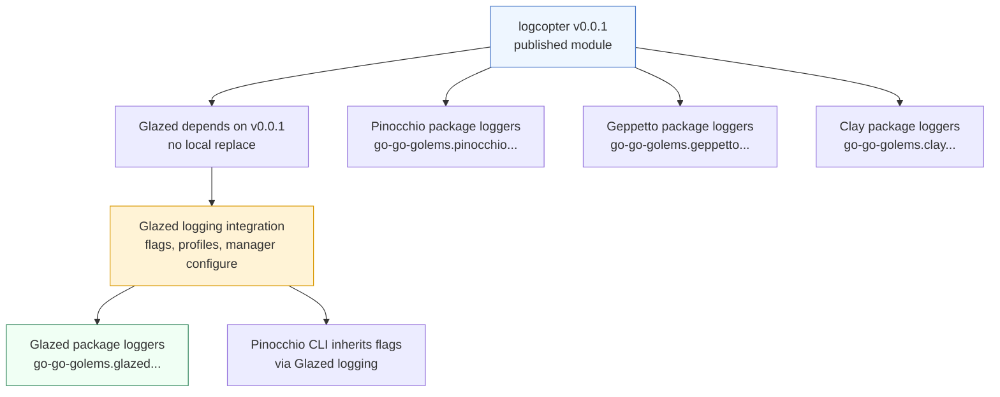

# Cross-repository logcopter rollout analysis and implementation guide

## Executive summary

`github.com/go-go-golems/logcopter@v0.0.1` has been published, so the workspace can move from local development integration to a real cross-repository rollout. The desired end state is that Glazed, Pinocchio, Geppetto, and Clay all support logcopter package-area logging with stable area prefixes of the form:

```text
go-go-golems.<package>.<subsystem>.<package-path-tail>
```

For example:

```text
go-go-golems.glazed.help.store
go-go-golems.pinocchio.ui.forwarders.agent
go-go-golems.geppetto.steps.ai.openai
go-go-golems.clay.repositories.trie
```

The rollout should start with **Glazed** because Glazed is the command/config integration layer. The earlier LOGCOPTER-001 work already modified `glazed/pkg/cmds/logging` in-place so that Glazed can parse `--log-config`, `--log-area`, `--strict-log-areas`, `logging.areas`, and direct logcopter profile files. However, `glazed/go.mod` still points at `github.com/go-go-golems/logcopter v0.0.0` with a local `replace ../logcopter`; this was correct for workspace validation but is wrong now that `v0.0.1` exists.

The first implementation phase is therefore dependency hygiene and Glazed self-adoption:

1. Update Glazed to depend on `github.com/go-go-golems/logcopter v0.0.1` without a local replace.
2. Generate or manually add package-local logcopter wrappers in Glazed packages that currently use `github.com/rs/zerolog/log` for diagnostics.
3. Preserve Glazed's command-level global logger behavior for existing users while adding area-scoped package diagnostics.
4. Validate that `--log-area go-go-golems.glazed.help.store=trace` enables one Glazed subsystem without making every Glazed package chatty.
5. Only after Glazed is stable, roll the same pattern into Pinocchio, Geppetto, and Clay.

This document is intentionally written for a new intern. It explains what logcopter is, how the existing logging stack works, what evidence was found in the repositories, how the prefixes should be derived, how to implement the first Glazed phase, and how to continue safely into Pinocchio, Geppetto, and Clay.

## Problem statement and scope

### The problem

The go-go-golems repositories already use `zerolog`, but much of the diagnostic code imports the global package logger:

```go
import "github.com/rs/zerolog/log"

log.Debug().Msg("...")
```

That style is simple, but it has one major limitation: diagnostics are filtered by the conventional global logger level. If a developer wants detailed traces from `geppetto/pkg/steps/ai/openai` while keeping `geppetto/pkg/inference/tools` quiet, there is no stable package-level name to configure.

Logcopter solves this by giving each package a stable area name and a reload-aware wrapper. The area becomes a configuration key:

```yaml
logging:
  log-level: info
  areas:
    go-go-golems.geppetto.steps.ai.openai: trace
    go-go-golems.geppetto.inference.tools: warn
```

The wrapper makes package-local logging reload-aware because it resolves the current manager state at call time. A raw `zerolog.Logger` would freeze its level; a logcopter `Logger` does not.

### Scope for this ticket

This ticket covers analysis and a phased rollout plan for four repositories:

1. `glazed`
2. `pinocchio`
3. `geppetto`
4. `clay`

The user asked to start with Glaze. Therefore, this guide treats Glazed as Phase 1 and gives it the most concrete implementation plan. The later repositories are mapped and planned, but should be implemented after the Glazed phase validates the dependency and generation pattern.

### Explicit non-goals for the first Glazed phase

Do **not** try to convert every logging call in every repository in one commit. That would make review difficult and increase the chance of accidentally changing runtime behavior.

Do **not** move logging initialization into Clay. Clay's logging helpers were already deprecated; Glazed owns logging and config initialization.

Do **not** replace all global logger usage blindly. Some code intentionally accepts or creates a `zerolog.Logger`, especially adapters and tests. Convert package-level diagnostics first; leave request-scoped or explicitly injected loggers alone unless there is a clear reason.

## Current-state evidence

### Glazed already has logcopter integration, but still uses the local development dependency

`glazed/go.mod` currently contains:

```text
github.com/go-go-golems/logcopter v0.0.0
replace github.com/go-go-golems/logcopter => ../logcopter
```

Evidence:

- `glazed/go.mod:19` requires `github.com/go-go-golems/logcopter v0.0.0`.
- `glazed/go.mod:138` replaces it with `../logcopter`.

That was acceptable while logcopter was unpublished. It must be replaced with the published `v0.0.1` before Glazed can be released or used outside the local workspace.

Glazed's logging settings already include logcopter-specific fields:

- `glazed/pkg/cmds/logging/section.go:20` defines `LogConfigFiles []string` for `log-config`.
- `glazed/pkg/cmds/logging/section.go:21` defines `LogAreas map[string]string` for `log-area`.
- `glazed/pkg/cmds/logging/section.go:23` defines `StrictAreas bool` for `strict-log-areas`.
- `glazed/pkg/cmds/logging/section.go:126-128` manually register `--log-config`, `--log-area`, and `--strict-log-areas` as root persistent flags.

Glazed's final logger initialization already configures logcopter:

- `glazed/pkg/cmds/logging/init.go:10` imports `github.com/go-go-golems/logcopter/pkg/logcopter`.
- `glazed/pkg/cmds/logging/init.go:54` keeps `zerolog.SetGlobalLevel(zerolog.TraceLevel)` permissive.
- `glazed/pkg/cmds/logging/init.go:59` calls `logcopter.Configure(...)`.
- `glazed/pkg/cmds/logging/init.go:291` defines `ParseAreaOverrides` for CLI overrides.

Glazed's early logging path also knows about logcopter flags:

- `glazed/pkg/cmds/logging/init-early.go:19` allows `--log-area` through early filtering.
- `glazed/pkg/cmds/logging/init-early.go:24` allows `--strict-log-areas`.
- `glazed/pkg/cmds/logging/init-early.go:95-97` registers `log-config`, `log-area`, and `strict-log-areas` on the early flag set.

Glazed's key-value parser has the needed syntax shape:

- `glazed/pkg/cmds/fields/parse.go:316` calls `splitKeyValueArgument` for `TypeKeyValue`.
- `glazed/pkg/cmds/fields/parse.go:690` defines that helper.

### Glaze binary uses Glazed logging but has not self-adopted package-area loggers

The `glaze` binary initializes logging through Glazed:

- `glazed/cmd/glaze/main.go:9` imports `github.com/go-go-golems/glazed/pkg/cmds/logging`.
- `glazed/cmd/glaze/main.go:25-27` calls `logging.InitLoggerFromCobra` in `PersistentPreRunE`.
- `glazed/cmd/glaze/main.go:31` adds the logging section to the root command.

The same file also optionally loads logcopter Markdown help entries from a sibling checkout:

- `glazed/cmd/glaze/main.go:37` calls `addLogcopterDocs`.
- `glazed/cmd/glaze/main.go:103-116` searches for `../logcopter/pkg/doc`, `../../logcopter/pkg/doc`, and `logcopter/pkg/doc`.

This is documentation integration only. It does not create package-local logcopter loggers for Glazed packages.

### Existing global zerolog usage is widespread

A repository scan found packages importing `github.com/rs/zerolog/log`:

| Repository | Go files importing `zerolog/log` | Meaning |
|---|---:|---|
| `glazed` | 16 | Small enough to convert in an initial focused phase. |
| `pinocchio` | 15 | Mostly command apps, UI/event forwarding, and middleware. |
| `geppetto` | 39 | Heavier conversion; AI provider and inference packages are high-value. |
| `clay` | 17 | Infrastructure/library packages such as watcher, repositories, filters, SQL. |

These counts exclude `ttmp/` scratch ticket files. They are not perfect measures of logging volume, but they show the shape of the work.

Representative evidence:

- `pinocchio/cmd/pinocchio/main.go:30` imports `zerolog/log`, and `pinocchio/cmd/pinocchio/main.go:103` logs `Executing pinocchio`.
- `pinocchio/cmd/web-chat/main.go:26` imports `zerolog/log`, with runtime server logs at `pinocchio/cmd/web-chat/main.go:203`, `257`, and `335`.
- `geppetto/pkg/steps/ai/openai/engine_openai.go:24` imports `zerolog/log`, and its engine emits many provider diagnostics beginning at `geppetto/pkg/steps/ai/openai/engine_openai.go:60`.
- `geppetto/pkg/inference/tools/definition.go:13` imports `zerolog/log`, and the tool reflection path logs many debug/error events beginning at `geppetto/pkg/inference/tools/definition.go:307`.
- `clay/pkg/init.go:8-9` imports Glazed logging and `zerolog/log`, and `clay/pkg/init.go:105-106` shows the deprecated `InitGlazed` wrapper still forwards to Glazed logging setup.

No repository other than Glazed currently has `logcopter.go` generated package loggers. A scan for `logcopter.go` found only `glazed/pkg/cmds/logging/logcopter_test.go`, which is a test file, not generated package adoption.

### Pinocchio already depends on Glazed's logging initialization

Pinocchio is a downstream application and should benefit from Glazed's logcopter-aware flags as soon as it uses a Glazed version that depends on logcopter `v0.0.1`.

The root command does early and final logging:

- `pinocchio/cmd/pinocchio/main.go:49` calls `logging.InitLoggerFromCobra`.
- `pinocchio/cmd/pinocchio/main.go:60` calls `logging.InitEarlyLoggingFromArgs` before command discovery.
- `pinocchio/cmd/pinocchio/main.go:161` still calls `clay.InitGlazed("pinocchio", rootCmd)`.

Other Pinocchio commands also use Glazed logging through the deprecated Clay wrapper:

- `pinocchio/cmd/web-chat/main.go:438` calls `logging.InitLoggerFromCobra`.
- `pinocchio/cmd/web-chat/main.go:444` calls `clay.InitGlazed("pinocchio", root)`.
- `pinocchio/cmd/agents/simple-chat-agent/main.go:311` calls `logging.InitLoggerFromCobra`.
- `pinocchio/cmd/agents/simple-chat-agent/main.go:316` calls `clay.InitGlazed("pinocchio", root)`.

This matters because Pinocchio rollout has two layers: package-local loggers in Pinocchio packages, and dependency/config cleanup so it uses the published Glazed/logcopter stack consistently.

### Geppetto and Clay are mostly library packages

Geppetto and Clay are not primarily root CLI integration layers. They are libraries used by Pinocchio and other applications. Their logcopter adoption should focus on package-local diagnostics, not on command initialization.

Geppetto currently depends on Glazed and Clay:

- `geppetto/go.mod:12` requires `github.com/go-go-golems/clay v0.4.9`.
- `geppetto/go.mod:13` requires `github.com/go-go-golems/glazed v1.2.7`.
- `geppetto/go.mod:22` already requires `github.com/rs/zerolog v1.35.1`.

Clay currently depends on Glazed and zerolog:

- `clay/go.mod:13` requires `github.com/go-go-golems/glazed v1.2.7`.
- `clay/go.mod:20` requires `github.com/rs/zerolog v1.35.1`.

The rollout should add `github.com/go-go-golems/logcopter v0.0.1` directly to each repository that contains generated package loggers. Do not rely on transitive dependency through Glazed; generated source imports `github.com/go-go-golems/logcopter/pkg/logcopter` directly.

## Target area naming convention

The user requested prefix form:

```text
go-go-golems.$package.xxx.yyy
```

Use this as the canonical rule:

| Repository | Area prefix | Strip prefix for package generation |
|---|---|---|
| `glazed` | `go-go-golems.glazed` | `github.com/go-go-golems/glazed` |
| `pinocchio` | `go-go-golems.pinocchio` | `github.com/go-go-golems/pinocchio` |
| `geppetto` | `go-go-golems.geppetto` | `github.com/go-go-golems/geppetto` |
| `clay` | `go-go-golems.clay` | `github.com/go-go-golems/clay` |

Examples:

| Go package | Area |
|---|---|
| `github.com/go-go-golems/glazed/pkg/help/store` | `go-go-golems.glazed.pkg.help.store` |
| `github.com/go-go-golems/pinocchio/pkg/ui/forwarders/agent` | `go-go-golems.pinocchio.pkg.ui.forwarders.agent` |
| `github.com/go-go-golems/geppetto/pkg/steps/ai/openai` | `go-go-golems.geppetto.pkg.steps.ai.openai` |
| `github.com/go-go-golems/clay/pkg/watcher` | `go-go-golems.clay.pkg.watcher` |

There is an open naming choice: whether to keep `pkg` and `cmd` in the area. The generator naturally keeps them because it derives from import paths. Keeping them has two advantages:

1. It is mechanically obvious and reproducible.
2. It avoids ambiguity between `cmd/foo` and `pkg/foo`.

A prettier alternative would strip `pkg` and `cmd`, producing `go-go-golems.glazed.help.store` instead of `go-go-golems.glazed.pkg.help.store`. That requires custom mapping logic or running different generator invocations per subtree. For the first rollout, the safer rule is to keep the path-derived names. If the user strongly prefers shorter names later, add an explicit mapping feature to `logcopter-gen`; do not hand-edit generated areas.

## Proposed architecture

The architecture is a layered rollout, not a single sweeping replacement.



The reason to start with Glazed is that Glazed owns configuration. Once Glazed is using a real `v0.0.1` dependency and has its own package-level diagnostics, downstream repositories can use one consistent command-line surface:

```bash
pinocchio --log-area go-go-golems.geppetto.pkg.steps.ai.openai=trace
pinocchio --log-area go-go-golems.pinocchio.pkg.ui.forwarders.agent=debug
```

That command should work because Pinocchio initializes logging through Glazed, while Geppetto and Pinocchio package loggers register areas with logcopter.

## First implementation phase: Glazed

### Phase 1.1 — Replace local logcopter dependency with v0.0.1

In `glazed`:

```bash
cd /home/manuel/workspaces/2026-05-25/logcopter/glazed
go get github.com/go-go-golems/logcopter@v0.0.1
```

Then remove the local replace:

```text
replace github.com/go-go-golems/logcopter => ../logcopter
```

Run:

```bash
go mod tidy
go test ./pkg/cmds/logging ./cmd/glaze
```

Expected review diff:

- `go.mod` should require `github.com/go-go-golems/logcopter v0.0.1`.
- `go.mod` should not contain a local `replace` for logcopter.
- `go.sum` should contain checksums for the published module.

### Phase 1.2 — Generate Glazed package loggers

Start with the packages that already import `github.com/rs/zerolog/log`. The scan found 16 files in Glazed:

```text
glazed/pkg/cli/cobra-parser.go
glazed/pkg/cli/cobra.go
glazed/pkg/cmds/cmds.go
glazed/pkg/cmds/template.go
glazed/pkg/help/help.go
glazed/pkg/help/site/render.go
glazed/pkg/help/store/loader.go
glazed/pkg/help/store/store.go
glazed/pkg/help/server/serve.go
glazed/pkg/help/loader/sources.go
glazed/pkg/cmds/loaders/loaders.go
glazed/pkg/cmds/logging/init.go
glazed/pkg/cmds/fields/file.go
glazed/pkg/formatters/table/table.go
glazed/pkg/cli/cliopatra/program.go
glazed/cmd/examples/register-cobra/main.go
```

Do not include every `cmd/examples/...` directory in the first pass unless needed. Examples can continue using global `log` or be converted later. The high-value first pass is `pkg/...`.

Run generator for `pkg` only:

```bash
go run github.com/go-go-golems/logcopter/cmd/logcopter-gen@v0.0.1 \
  -area-prefix go-go-golems.glazed \
  -strip-prefix github.com/go-go-golems/glazed \
  ./pkg/...
```

This generates `logcopter.go` files in each package under `pkg/...`. The generated variable name defaults to `log`:

```go
var log = logcopter.Package("go-go-golems.glazed.pkg.help.store")
```

That default is useful because most package files currently call `log.Debug()` or `log.Warn()`. Once a package has generated `var log`, remove the import of `github.com/rs/zerolog/log` from files in that package and let the package-level generated variable satisfy the existing calls.

### Phase 1.3 — Avoid shadowing in packages that need both styles

Some packages may currently use both the global logger and explicit `zerolog.Logger` values. The rule is:

- If code only calls package diagnostics like `log.Debug().Msg(...)`, convert to generated package `log`.
- If code intentionally needs `zerolog/log.Logger` as a default injected logger, be careful.

A representative example outside Glazed is `geppetto/pkg/inference/middleware/logging_middleware.go`, which accepts a `zerolog.Logger` and falls back to `log.Logger`. That pattern should not be blindly converted to a logcopter wrapper because the function's API is about a concrete logger value.

In Glazed, inspect each converted package after generation:

```bash
rg -n 'github.com/rs/zerolog/log|log\.Logger|log\.With\(' pkg
```

If a package still needs the global zerolog package, alias it explicitly:

```go
import zlog "github.com/rs/zerolog/log"
```

Then use `zlog.Logger` for global zerolog interop and `log` for package-area diagnostics. This is clearer than trying to make one identifier mean both things.

### Phase 1.4 — Add generated-file check

Glazed should get a CI check similar to logcopter's example check. Add a Make target or CI step:

```bash
go run github.com/go-go-golems/logcopter/cmd/logcopter-gen@v0.0.1 \
  -area-prefix go-go-golems.glazed \
  -strip-prefix github.com/go-go-golems/glazed \
  -check \
  ./pkg/...
```

If Glazed wants to avoid regenerating every package in CI, create an allowlist initially. But the long-term simpler rule is: if the repo commits generated package logger files, CI should ensure they stay current.

### Phase 1.5 — Validate Glazed area behavior

Add or extend Glazed tests so they prove a Glazed package area can be configured independently. Pseudocode:

```go
func TestGlazedPackageAreaCanTraceWhileDefaultWarn(t *testing.T) {
    buf := bytes.Buffer{}
    base := zerolog.New(&buf)

    err := logcopter.Configure(base, logcopter.Config{
        Level: "warn",
        Areas: map[string]string{
            "go-go-golems.glazed.pkg.help.store": "trace",
        },
    })
    require.NoError(t, err)

    // Call a package logger in help/store or expose a tiny test-only log call.
    helpStoreLog.Trace().Msg("trace visible")

    require.Contains(t, buf.String(), "trace visible")
}
```

In practice, avoid exporting loggers just for tests. It is enough to validate generated logger registration and effective levels:

```go
require.Equal(t,
    zerolog.TraceLevel,
    logcopter.EffectiveLevel("go-go-golems.glazed.pkg.help.store"),
)
```

Also run command smoke tests:

```bash
go test ./pkg/cmds/logging ./pkg/help/... ./pkg/cli/...
go run ./cmd/glaze --log-area go-go-golems.glazed.pkg.help=debug help logging-section-reference
```

## Later implementation phases

### Phase 2 — Pinocchio

Pinocchio is the first downstream application because it already uses Glazed logging in multiple binaries.

Dependency update:

```bash
cd pinocchio
go get github.com/go-go-golems/glazed@<version-containing-logcopter>
go get github.com/go-go-golems/logcopter@v0.0.1
go mod tidy
```

Generate loggers:

```bash
go run github.com/go-go-golems/logcopter/cmd/logcopter-gen@v0.0.1 \
  -area-prefix go-go-golems.pinocchio \
  -strip-prefix github.com/go-go-golems/pinocchio \
  ./pkg/... ./cmd/pinocchio/... ./cmd/web-chat/...
```

Be conservative with `cmd/...`. Pinocchio has several example and agent commands. Start with production command trees:

- `cmd/pinocchio/...`
- `cmd/web-chat/...`
- `cmd/agents/simple-chat-agent/...`
- `pkg/...`

Pinocchio should also stop relying on Clay's deprecated `InitGlazed` wrapper in touched command files. Replace:

```go
clay.InitGlazed("pinocchio", rootCmd)
```

with:

```go
logging.AddLoggingSectionToRootCommand(rootCmd, "pinocchio")
```

Do this only where the file already imports Glazed logging, such as `pinocchio/cmd/pinocchio/main.go`, `pinocchio/cmd/web-chat/main.go`, and `pinocchio/cmd/agents/simple-chat-agent/main.go`.

Validation:

```bash
go test ./cmd/pinocchio ./cmd/web-chat ./cmd/agents/simple-chat-agent ./pkg/...
go run ./cmd/pinocchio --log-area go-go-golems.pinocchio.pkg.ui.forwarders.agent=debug --help
```

### Phase 3 — Geppetto

Geppetto is the largest logging conversion because the scan found 39 non-ticket Go files importing the global zerolog package. It also contains high-value debugging targets: provider engines, streaming code, tool reflection, inference middleware, structured sinks, and event routing.

Dependency update:

```bash
cd geppetto
go get github.com/go-go-golems/logcopter@v0.0.1
go mod tidy
```

Generate loggers for `pkg` first:

```bash
go run github.com/go-go-golems/logcopter/cmd/logcopter-gen@v0.0.1 \
  -area-prefix go-go-golems.geppetto \
  -strip-prefix github.com/go-go-golems/geppetto \
  ./pkg/...
```

High-value areas to test:

```text
go-go-golems.geppetto.pkg.steps.ai.openai
go-go-golems.geppetto.pkg.steps.ai.openai_responses
go-go-golems.geppetto.pkg.steps.ai.claude
go-go-golems.geppetto.pkg.steps.ai.gemini
go-go-golems.geppetto.pkg.inference.tools
go-go-golems.geppetto.pkg.events.structuredsink
go-go-golems.geppetto.pkg.inference.middleware
```

Do not blindly convert files that use `log.Logger` as a concrete `zerolog.Logger` value for adapters or fixtures. For those, either leave the global import aliased as `zlog`, or inject a raw logger intentionally.

Validation should include provider package tests and any smoke tests that do not hit live APIs:

```bash
go test ./pkg/inference/... ./pkg/events/... ./pkg/steps/ai/...
```

### Phase 4 — Clay

Clay is mostly infrastructure. Useful areas include:

```text
go-go-golems.clay.pkg.watcher
go-go-golems.clay.pkg.repositories
go-go-golems.clay.pkg.filters.command
go-go-golems.clay.pkg.sql
go-go-golems.clay.pkg.workerpool
```

Dependency update:

```bash
cd clay
go get github.com/go-go-golems/logcopter@v0.0.1
go mod tidy
```

Generate loggers:

```bash
go run github.com/go-go-golems/logcopter/cmd/logcopter-gen@v0.0.1 \
  -area-prefix go-go-golems.clay \
  -strip-prefix github.com/go-go-golems/clay \
  ./pkg/...
```

Clay should not regain ownership of logging initialization. Its deprecated `InitGlazed` wrapper should stay deprecated or be removed in a future major cleanup. For LOGCOPTER-002, Clay package diagnostics can adopt logcopter, but root command logging setup remains Glazed territory.

Validation:

```bash
go test ./pkg/...
```

Clay watcher tests can be noisy; use area-level filtering when debugging:

```bash
go test ./pkg/watcher -run TestName --log-area go-go-golems.clay.pkg.watcher=debug
```

The exact command depends on whether the test binary wires Glazed logging flags. Package tests usually do not, so test-level logger setup may still be needed for verbose test diagnostics.

## Implementation pseudocode

### Repository rollout function

The mechanical workflow for each repository is:

```text
rollout(repo, modulePath, areaPrefix, packagePatterns):
  ensure clean git status, except known unrelated docs
  go get github.com/go-go-golems/logcopter@v0.0.1
  if repo == glazed:
    remove local replace for logcopter
  go mod tidy

  run logcopter-gen:
    -area-prefix areaPrefix
    -strip-prefix modulePath
    packagePatterns

  for each package with generated logcopter.go:
    remove import "github.com/rs/zerolog/log" if all uses are package diagnostics
    if concrete global zerolog logger is still needed:
      alias import as zlog and update those references

  gofmt generated and edited files
  go test targeted packages
  run generator -check
  commit repository-specific change
```

### Import rewrite rule

For most packages, the code change is not changing call sites; it is deleting the global import.

Before:

```go
package store

import "github.com/rs/zerolog/log"

func Load() {
    log.Debug().Msg("loading")
}
```

Generated file:

```go
package store

import logcopter "github.com/go-go-golems/logcopter/pkg/logcopter"

var log = logcopter.Package("go-go-golems.glazed.pkg.help.store")
```

After:

```go
package store

func Load() {
    log.Debug().Msg("loading")
}
```

The call site stays the same. The meaning of `log` changes from global zerolog package to package-local logcopter wrapper.

### Strict validation sequence

Strict area validation is useful, but only after packages have registered their generated loggers. The safe sequence is:

```text
package init:
  generated var log = logcopter.Package("go-go-golems.geppetto.pkg.steps.ai.openai")

application startup:
  imports packages, package vars register known areas
  Glazed InitEarlyLoggingFromArgs may configure early state
  Cobra discovers commands, imports more packages
  Glazed InitLoggerFromCobra applies final config
  if strict areas enabled:
    configured areas are checked against known areas
```

The caveat is dynamic/plugin loading. If a package is not imported before final logging initialization, its area is not known yet. For dynamic commands, start with non-strict mode and move to strict mode once command discovery behavior is understood.

## Testing strategy

### Glazed first-phase tests

Run at minimum:

```bash
cd glazed
go test ./pkg/cmds/fields ./pkg/cmds/logging ./cmd/glaze
go test ./pkg/help/... ./pkg/cli/... ./pkg/cmds/...
go run ./cmd/glaze --log-area go-go-golems.glazed.pkg.help=debug help logging-section-reference
```

If generated files are added to Glazed:

```bash
go run github.com/go-go-golems/logcopter/cmd/logcopter-gen@v0.0.1 \
  -area-prefix go-go-golems.glazed \
  -strip-prefix github.com/go-go-golems/glazed \
  -check \
  ./pkg/...
```

### Cross-repository validation after Glazed

After Glazed is updated to a real logcopter version, downstream modules should be checked one at a time:

```bash
cd pinocchio && go test ./cmd/pinocchio ./cmd/web-chat ./pkg/...
cd geppetto && go test ./pkg/...
cd clay && go test ./pkg/...
```

Do not run all broad test suites blindly if they contain live-provider tests. Prefer targeted packages first, then broaden if the repository's normal CI commands are known to be offline-safe.

### Behavior tests to prove the feature

The most important behavior test is not that files compile. It is that one area can be verbose while another is quiet.

Pseudocode:

```go
func TestAreaSpecificFiltering(t *testing.T) {
    var buf bytes.Buffer
    base := zerolog.New(&buf)

    require.NoError(t, logcopter.Configure(base, logcopter.Config{
        Level: "warn",
        Areas: map[string]string{
            "go-go-golems.glazed.pkg.help.store": "trace",
        },
    }))

    storeLog.Trace().Msg("visible")
    otherLog.Debug().Msg("hidden")

    require.Contains(t, buf.String(), "visible")
    require.NotContains(t, buf.String(), "hidden")
}
```

This can be implemented in a small test package or through existing package log calls if a stable call path exists.

## Risks and mitigations

### Risk: identifier collision with imported `log` package

Generated files create `var log = ...`. This is intentional because it allows many call sites to remain unchanged. But it means every file in the package can no longer import `github.com/rs/zerolog/log` as `log`.

Mitigation: remove the import when it is only used for diagnostics. If concrete global zerolog interop remains necessary, alias it as `zlog`.

### Risk: generated files in too many packages

Running the generator over `./...` can touch examples, tools, and testdata-style packages. That creates noisy diffs.

Mitigation: start with `./pkg/...` in Glazed. Add `cmd/...` only when those packages contain real application diagnostics worth configuring.

### Risk: local replace leaks into published modules

Glazed currently has a local `replace`. If this remains, downstream users cannot consume Glazed cleanly.

Mitigation: make removal of the local replace the first Glazed implementation task. Validate with `GOWORK=off go list -m all` inside Glazed.

### Risk: dependency cycles through Glazed, Clay, Geppetto, and Pinocchio

Logcopter itself should remain independent of Glazed. Repositories can depend on logcopter directly for generated package loggers. Glazed can depend on logcopter for logging integration. Clay should not become the logging integration owner again.

Mitigation: keep the dependency direction:

```text
applications/libraries -> logcopter runtime
applications -> Glazed logging setup
Glazed -> logcopter runtime
logcopter -> zerolog only, not Glazed
```

### Risk: strict area validation fails before dynamic commands load

Pinocchio dynamically loads commands from repositories. If those commands contain package loggers whose packages are not imported before final logging initialization, strict validation may reject otherwise-valid areas.

Mitigation: keep `strict-log-areas` opt-in. For Pinocchio, test strict mode only after command-loading order is understood.

## Alternatives considered

### Alternative 1: Leave package code on global zerolog and only configure Glazed

This is insufficient. Glazed can parse `--log-area`, but without generated package loggers there are no package-specific areas to configure. All package diagnostics continue to flow through the conventional global logger.

### Alternative 2: Add one shared logger package per repository manually

A manual package such as `pkg/logging` could define loggers by hand. This is less reliable than generation. It invites drift between import paths and area names, and it makes adding new packages a manual task.

### Alternative 3: Strip `pkg` and `cmd` from area names immediately

Short names are nice, but the generator currently maps import path suffixes directly. Hand-stripping path components would make generated names less predictable. Keep direct path-derived names for the first rollout; improve the generator later if shorter names are worth it.

## Concrete task list

### Glazed tasks

- [ ] Update `glazed/go.mod` to `github.com/go-go-golems/logcopter v0.0.1`.
- [ ] Remove `replace github.com/go-go-golems/logcopter => ../logcopter` from Glazed.
- [ ] Run `go mod tidy` in Glazed.
- [ ] Generate `logcopter.go` files for `glazed/pkg/...` with prefix `go-go-golems.glazed`.
- [ ] Remove or alias `github.com/rs/zerolog/log` imports in converted Glazed packages.
- [ ] Add Glazed generated-file check.
- [ ] Validate `go test ./pkg/cmds/fields ./pkg/cmds/logging ./cmd/glaze`.
- [ ] Validate targeted Glazed package tests for converted packages.
- [ ] Smoke test `go run ./cmd/glaze --log-area go-go-golems.glazed.pkg.help=debug help logging-section-reference`.
- [ ] Commit Glazed changes.

### Pinocchio tasks

- [ ] Update Pinocchio to a Glazed version containing the logcopter integration.
- [ ] Add direct `github.com/go-go-golems/logcopter v0.0.1` dependency.
- [ ] Generate package loggers with prefix `go-go-golems.pinocchio`.
- [ ] Convert package diagnostics from global zerolog imports to generated package loggers.
- [ ] Replace touched `clay.InitGlazed` calls with `logging.AddLoggingSectionToRootCommand`.
- [ ] Validate root command, web-chat, and simple-chat-agent smoke tests.

### Geppetto tasks

- [ ] Add direct `github.com/go-go-golems/logcopter v0.0.1` dependency.
- [ ] Generate package loggers with prefix `go-go-golems.geppetto` for `./pkg/...`.
- [ ] Convert high-value AI provider and inference packages first.
- [ ] Preserve explicit `zerolog.Logger` injection APIs.
- [ ] Validate targeted provider/inference/event tests.

### Clay tasks

- [ ] Add direct `github.com/go-go-golems/logcopter v0.0.1` dependency.
- [ ] Generate package loggers with prefix `go-go-golems.clay` for `./pkg/...`.
- [ ] Convert watcher, repositories, filters, SQL, and workerpool package diagnostics.
- [ ] Keep Clay logging initialization helpers deprecated; do not make Clay the integration layer.
- [ ] Validate `go test ./pkg/...`.

## Recommended implementation order

The safest order is:

1. Glazed dependency cleanup and self-adoption.
2. Glazed release or local downstream replacement to test published dependency behavior.
3. Pinocchio adoption, because it exercises Glazed early/final logging in a real application.
4. Geppetto adoption, because it has the richest diagnostic use cases and many package-level log calls.
5. Clay adoption, because it is mostly infrastructure and should not influence initialization design.

This order keeps the configuration layer stable before converting downstream package diagnostics.

## References

Primary repositories:

- `/home/manuel/workspaces/2026-05-25/logcopter/logcopter`
- `/home/manuel/workspaces/2026-05-25/logcopter/glazed`
- `/home/manuel/workspaces/2026-05-25/logcopter/pinocchio`
- `/home/manuel/workspaces/2026-05-25/logcopter/geppetto`
- `/home/manuel/workspaces/2026-05-25/logcopter/clay`

Primary files:

- `glazed/go.mod`
- `glazed/pkg/cmds/logging/section.go`
- `glazed/pkg/cmds/logging/init.go`
- `glazed/pkg/cmds/logging/init-early.go`
- `glazed/pkg/cmds/fields/parse.go`
- `glazed/cmd/glaze/main.go`
- `pinocchio/cmd/pinocchio/main.go`
- `pinocchio/cmd/web-chat/main.go`
- `pinocchio/cmd/agents/simple-chat-agent/main.go`
- `geppetto/pkg/steps/ai/openai/engine_openai.go`
- `geppetto/pkg/inference/tools/definition.go`
- `clay/pkg/init.go`

Supporting docs:

- `LOGCOPTER-001` design and diary under `logcopter/ttmp/2026/05/25/LOGCOPTER-001--initial-logcopter-implementation-design`.
- Logcopter README: `logcopter/README.md`.
- Glazed logging help: `glazed/pkg/doc/topics/logging-section.md`.
